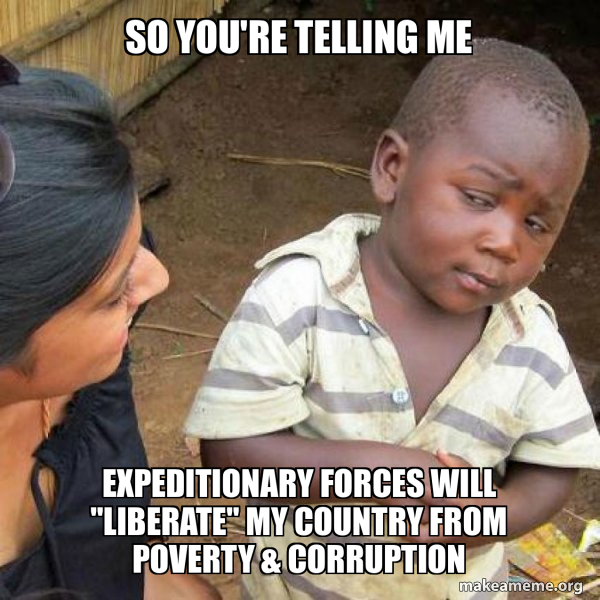

# Future Soldier Program 

What types of things can be estimated, about the future of a soldier's life on the front-lines, within the battle fields of full-spectrum modern warfare? 

## 1. Introduction

One of the very first projects I was involved in, during 2008-2009, had to do with answering the question:

>Which aspect of the military (US and NATO) requires investment and development now, so that its soldiers can handle the upcoming challenges of the future, with a 10 year, and a 30 year horizon? 

Let me first explain some of the reasons to ever consider such an open ended question, in sincerity and seriousness. 

The idea that a military is deficient or lacking, in some area, is almost never admitted by any country's government. However, as realists, it is necessary to acknowledge the fact that, a military platoon or a squad, is able to handle a current-day challenge, only because of investments made 10 to 30 years ago, into the equipment, education, training, and readiness of those troops. With each consecutive year that passes by, new challenges crop up, and when a particular challenge is not met by any of the strategists and tacticians, it becomes evident that a shift in attitudes and "visioning" is needed, to quickly ramp up production as well as deployment of necessary resources. 

An example of a military realizing things too late, was the Japanese military prior to World War I, when its insular and traditional approach to warfare, prevented it from investing in rifles, riflemen, air crafts, pilots, submarines, submariners, surface-to-air ballistics, digital communication methods, along with all of the logistical supply lines and human resource development programs that had gone into shaping the preparedness, of modern units belonging to British and American armed forces. 

Of course, the Japanese rapidly improved their readiness, but then decided to ally with German Imperialists and Nazi forces, to invade Manchuria in mainland Asia, to capture the mineral and fossil fuel resources needed for driving Japan's imperial objectives. By the end of World War II, Japan again had to reevaluate its future course of research and development efforts, more acutely than all other countries of the world, due to the shocking events at Hiroshima and Nagasaki generated by America's nuclear Weapons of Mass Destruction (WMD). 

WWII proved to all countries alike, that there is no such thing as a morally or an ethically distinct form of a good move, or a bad move in battles, there is only the next viable move. How then, does one decide on norms governing war crimes and crimes against humanity? The countries and their heads of state, which declared themselves as the world's "Super Powers" after the nineteen-forties, are certainly above all notions and established [international laws concerning war crimes,](https://en.wikipedia.org/wiki/Rome_Statute) because their warlords and underlings have never been prosecuted by any entity what-so-ever, for their myriad of ongoing global-scale genocidal activities since WWII. 

So, by the time a country like India had managed to produce its indigenous nuclear weapons program, to create a single thermonuclear device that was tested at [Pokhran](https://en.wikipedia.org/wiki/Smiling_Buddha), it was already mid-nineteen-seventies, which was more than 30 years from when other countries in Europe and North America had started their research and development programs, for nuclear weapons based warfare. 

That is why, it is only natural for military strategists and world leaders of a country to ask, "Which areas of industrial research and development need to be prioritized now?", so that their country isn't suddenly caught unaware or unprepared down the line, in the future, during potential and actual armed conflicts with seemingly distant, or close-by neighboring countries. 

Too bad, almost all of those think-tanks and strategic planning committee members of parliaments in various countries, simply forgot to include [Climate Change](https://youtu.be/RtItB0TewXI) as a factor within national plans and assessments they created 30 years ago. In fact, even now, many of them in industrialized as well as industrializing countries, still don't acknowledge Climate Change as, "a real and pressing concern." 

After [the recent COP28 meeting in Dubai, UAE,](https://youtu.be/fIxQQsUNcpc) central and chartered banks suddenly downgraded investment ratings of new, zero emission technologies in various heavy industry sectors, and yet again, decided to give priority to funding so-called "clean energy initiatives" from coal, natural gas, and crude oil. The idea that a tiny "Climate Disaster Fund" and empty promises for cutting down emissions form fossil fuel giants, will somehow improve the ability of OECD countries to face global-scale conflicts, is ludicrous. 

But, many governments across the planet, sighed with relief by the end of COP28 meetings, upon realizing that more fossil fuel will be made available from OPEC, "at a reasonable price point, and a practically guaranteed supply volume, of piped or shipped fossil fuels." Governments in way too many countries were stressed out, that none of their existing research and development projects were going to provide any kind of significant results, in the coming two decades, to meet the growing demand for electric energy and heating within their country. Particularly, the industrial-military complex in those countries, decided that it was too early to be able to shift to different forms of transportation and logistical supply chains, that aren't dependent on internal combustion engines and gas turbines. 

Moreover, the entire aviation industry of the world, currently has no commercially viable alternative to burning hydrocarbons, for activities involving production and operation of military as well as civilian air crafts and airports. It is also likely, that by the year 2043, 20 years from now, commercial airline carriers like Emirates Airlines and airplane manufacturers like Boeing Company, will not have a single aerial vehicle in operation for transporting freight or passengers, that can be certified as zero carbon emission vehicles. 

If airports across the world are to remain in operation, the production and supply of aviation jet fuel has to at least match the rate of growth within commercial airways, especially for domestic and international travelers, and for supply of goods by airmail. Aside from that, the portion of all globally available jet fuel, which is procured and appropriated by a country for its military, during peace time and during war, is by itself, a significant indicator of where that country's economy is heading. 

Any secret stash of aviation grade fuels, is too difficult to maintain as a secret for more than two to three years, because of corrupt and undervalued grunt workers employed by the military of each and every country, and because of advanced satellite imagery based surveillance, of every commodity's supply-chain networks. 

Compared to airways, the oceanic shipping industry has had fuel cells and nuclear reactors, that can be safely operated as engines of ships and submarines, for a mighty long time. However, those technologies were scuttled decades ago for use in civilian water vehicles, and have only been maintained by few military regiments for their naval operations. 

Next, in comparison to both airways and seaways of the modern age, railways in countries like China and India, are currently profit making as opposed to those in the US and Canada. All of those rail companies, with their monopolies within their respective countries, are much more prone to corruption than airways, mainly because of their continued dependence upon under-educated and very low paid non-unionized workers. Workers' unions, happen to make sure that their members stay upright, honest, appropriately skilled, and decent. Demolishing workers' unions, also demolishes a culture of honesty and peer-support among wage and salary earners. But, those railway companies could become more profitable and secure, when upgraded to operate on nuclear energy based electrification and communication grids. Having said that, countries like India, are practically beholden to fossil fuel overlords, from having been stigmatized by the possibility of being made to suffer like Iran, due to trade embargoes by NATO and its allies, on development of nuclear energy production and high-performance computing, in countries that aren't submissive to Washington D.C.  

So, where will soldiers need to be deployed with advanced night-vision goggles and close-combat support from aerial, terrestrial, sea, and orbital space based supply networks? Deep within the furthest parts of Central Asia, Africa, Oceania, and South America. Basically all of the locations that the erstwhile British Empire didn't manage to conquer, or ended up loosing to the idea of, "independence from imperialism and colonialism." 

As such, are there any issues and challenges that those soldiers will simply not be able to counter-act or handle, no matter the amount of investment that is dumped into their missions, within the current and the next few years, because of decisions made by leaders within NATO group of countries in the past decade? We will explore possible answers to such question's and their antecedent factors, in this article. 


### Important Note:

Climate Change isn't only about carbon dioxide and methane emissions impacting the globe, it is also about all other emissions related to nitrogen and sulfur oxides in air, as well as toxic effluents dumped into water and soil profiles of the world, along with, 

- top soil erosion,

- excessive use of pesticides and fertilizers that cause ecological damage,

- emergence of new types of diseases impacting plants and animals at a pandemic level,

- worsening scarcity of potable water in rich as well as poor countries, and 

- shift in oceanic currents. 


<div align = "center">

<a href="https://youtu.be/lZDsJ-nz-GI"><span>Would you take sponsorship money from arms dealers for a peace conference, <br/> or hand the fire extinguisher to the arsonist who attacked your house?</span></a> 

<br>


</div>

<br>

## 2. Implicit Association Tests

>Do you implicitly trust somebody as an authority figure, as a person for whom you would do anything, simply because you wouldn't want to upset them, or just because you want to, or need to, gain their approval and admiration? 

You most probably do, whether you know it or not. But do try to visualize who that person is, or could be. 

Is it somebody who is or was a care giver to you? Perhaps a spiritual guide, or a teacher, or a community leader of some sort? Maybe a familial or a parental figure, somebody you look up to, and want to be someday? Or somebody you are afraid of? Or perhaps, somebody who gave you a shot at life and at making something worthwhile of yourself; someone who took you in, protected you and stood by your side, when simply no other person could, or would, lend you a helping hand or even bother to notice you. 

You most certainly owe them something important, that is why, you are decidedly committed or dedicated to obeying them, nay, you are most probably, devoted to them. 

Deep down within your psyche, you trust them more than you would trust yourself or any other voice in your head. Their voice, their slightest presence, alerts you to be your best, and to do your best, not just for them or for your own sake, but for the future you've come to envision, because of them. 

To trust someone, with your life, is most probably the highest esteem, you could pay to them. And by now, you must have come to realize that there is no other currency, more valid or more true, than the respect and admiration you've given someone for who they are, and for all that they have done for you, in order to make you who you are. 

Your morality, your outlook, your speech, viewpoint, demeanor, decisions, and even your gait, most probably mirrors or follows closely, like theirs, or like the one they would approve and be proud of. 

Likewise, is there somebody you implicitly distrust? Somebody you will not, or should not trust, and then rely upon, because you know better than to ever give them the benefit of any likelihood that they could possibly, ever be, trustworthy and truthful? 

There most probably is, at least one such person in your life, that you can't seem to get rid of or have them stay sufficiently at bay, regardless of whether you would like to admit it out loud or not. 

By the way, *trust* is based on the assumptions you have about a person's intentions and "known reputation"; whereas, *reliance* is based on the measurable experience you have personally had, pertaining to someone's behaviors in your presence. Trust, eventually waxes or wanes, based on repeated experience of the type of expectations, that have been met, or unmet, over a period of time.  

Now, before we dwell deeper into the topic of trust and how to measure it, including the implicit form of it which manifests subconsciously and without hesitation, let us first look at the concepts of guilt and shame, shall we? 

Guilt is a conscious emotion, which arises in hindsight, when you feel significantly remorseful or bad, upon realizing something that you did, or didn't do, when you had the opportunity to follow through with a decision. Guilt pertains to actions and behaviors you have already committed, based on your assessment of what you were or weren't supposed to do. 

Shame, is a deeper emotional response than guilt. It is an emotion that arises because of a realization of who you are as a person, or because of an aspect of your individuality, which is somehow regrettable. Shame isn't about what you have or haven't done, nor about what you can or cannot do, it is about who you have been, and about certain aspects of who you undeniably, still happen to be.  

You could, for instance, ascribe a strong guilty verdict to some other individual, if you imagined yourself behaving like them, or for doing something they supposedly "perpetrated", and then felt guilty by merely imagining yourself in their position. You would also, most probably, call them guilty of a certain thing, if that thing were to be done to you and cause you suffering or harm. Likewise, you would shame someone else, for being a certain type of a person, not simply for how they behave or for their activities, but for a personality trait that they have, if you were to imagine yourself having that trait, and then feeling ashamed or humiliated in front of people upon that fact being revealed to the public. 

As such, shamelessness, is merely a character trait where one does not feel any sense of regret or remorse, for being a publicly derided and reviled person for traits that you yourself would find truly offensive, in other, seemingly good people. Similarly, a lack of guilt for doing something bad, even when you happen to know that the same or a similar bad thing being done to you, would make you justifiably angry or bitter, is merely due to hypocrisy, particularly a type of hypocrisy that the shameless are oblivious to. 

It should be somewhat obvious, that one would rather only trust those who are not shameless hypocrites, right? And perhaps, there is a gradation, or a spectrum of trustworthiness that one such as yourself tends to ascribe to others, based on your experiences in having interacted with them in various types of circumstances and situations. You might like to believe that people in your life, are more or less trustworthy, some more than others, especially for possessing particular types of skills demonstrable in certain types of situations. 

However, the concept of implicit trust is the base level of confidence you are willing to invest in a person, in the face of uncertainty and lack of information, irrespective of your past interactions with them, and regardless of the circumstances and situations that may present themselves requiring you to have some level of confidence in who they are as a person, and in what they reveal to you over subsequent interactions. 

There is indeed, a method for precisely and somewhat accurately measuring that implicit level of trust you already have, in one type of a person or a group of people, compared to another type of a person, or a group of people. Furthermore, your resting level of trust in machines, places, artifacts, and brand names of corporate entities, can also be measured, in a relativistic and comparative sense, using a method known as ["Implicit Association Test" (IAT).](https://en.wikipedia.org/wiki/Implicit-association_test)[^1] 

Well actually, the IAT, in the way it has been innovated and created by its researchers, doesn't just measure trust, it measures the relativistic degree of relatedness in short-term memory recall, between given pairs of concepts.  

What is the difference between "concepts" and "constructs?" There isn't much of a difference; concepts are all conceivable things that the human mind can interact with, and constructs are things, that supposedly, only a particular community or a group of people happen to be knowledgeable about. Constructs are concepts or a cluster of concepts, that have a specific name, or a word, or a logo, assigned to them, for the purposes of using them within communications, by a group of people who use those constructs within a context known to the "in group", by virtue of the socio-economic, political, and ecological circumstances of the in group's members. 

A construct used by one group of people, usually has a significantly different meaning, compared to a construct by the same name (identifier) used by another community of people. For example, the construct known as "physical state" has a drastically different meaning for physicists compared to any bureaucrats who are not trained as physicists or mathematicians. 

So, while IAT may have lots of cute, pop-science applications that can be turned into online click-baits, its use for the military, the US military, as envisioned by the lab I used to work in, was somewhat like this:

- Create a set of stimuli, Set A, with category of things that are to be measured as likable or preferable, compared to another set of stimuli, Set B. Have 30 or 40 distinct items in each set. 

- Select a randomized item from each set, place them side-by-side on a computer screen, and then have a person click on a button to exclusively indicate their preference of one, over the other, within millisecond duration of time period. 

    - It takes only 200 to 300 milliseconds for an adult person with unaided or corrected vision, to identify two separate images on a blank background (black, gray, white, or any other background), if that pair of images is at the focal distance of the person's eye. 

    - Clicking a button to decide on Image X vs Image Y, takes about 400 to 600 milliseconds for young adults who don't have any impairments, which includes the entire pathway between noticing what the shown images contained, deciding on a preference, initializing a neuro-muscular response to click on a button, and, the electromechanical connection between the button and the computerized apparatus being used for the experiment. 

    - To ease the participant into the experiment, the images can be shown on the screen for a period of 2.5 seconds, and sped up after every two or three pairs, to eventually show each pair of stimuli, for 0.8 seconds. 

    - Use Linux instead of Windows operating system, or, disable multi-threading on Windows based CPU clock management, for better precision in test results. 

- The participants eventually make rapid decisions and reactions to shown stimuli, and the pairs of stimuli can be repeated. A stable response to given pairs emerges after 15 or 20 pairs of stimuli, where "mistakes" of a participant due to anticipation and inhibition, as well as muscle memory and priming, get [convolved](https://en.wikipedia.org/wiki/Convolution#Visual_explanation) into the obtained results. 

- Then, other sets of categories of concepts or constructs, can be paired in a variety of ways, to obtain a binary-tree structure of results, indicating latent preferences buried within the psyche of the human participant's mind. The same type of tests can also be done with animals, but those results aren't that interesting because the animals have to be forced and coerced into participating in the studies, using rather cruel and inhumane methods. Humans tend to enjoy doing the test because it feels like a fun game, some are even eager to learn the results of their "hidden inner self", but others are simply voluntold or ordered to get on with it. 

So, now, let's talk about the more specific topic of the level of implicit trust soldiers and pilots may have, in their commanding officer, for example. 

To test the level of confidence a soldier has in their commander, construct stimuli labeled Set A, with photographs and-or names of various superior officers, and another Set B, with positive words pertaining to trustworthiness as well as negative words pertaining to distrust. Go through the experiment's method using commercially available apparatus, and you will find which soldier is more inclined towards trusting a particular officer. And yes, you will also be able to find out which officers are somehow, distrusted by a statistically significant batch of test participants. 

But you see, that is not a particularly problematic nor an unethical way of using IAT from the perspective of human factors research, or human resources management science. The more problematic way, would be to have a set of stimuli which has photographs of children who appear to have Middle-Eastern or African facial features with brown or black skin tone, and the other set of stimuli to test if the soldier would readily kill them. Find the group of soldiers who would or would not kill children of color, make them go through physical as well as virtual reality drills where the targets have the resemblance of Middle-Eastern or African children, and see if the soldiers follow given orders. After those drills, repeat the IAT to measure change in latent sensitivity towards shooting and killing the target, or not shooting and killing specified targets. Then, filter in, or filter out soldiers based on results of subsequently repeated drills and IAT tests over a period of weeks, or months. Would such a suite of tests be ethical, or non-ethical? Regardless, what would *you* ever be be able to do about it? 

Could the same type of procedural steps be created to desensitize soldiers into more easily killing a target using drones, by hiding the photo-realistic video data from cameras of what the drone's missiles are about to hit, and by replacing that data with simplistic geometric shapes? Sure, it can, and has been done. But why would you take my word for it, right? 

More importantly, could the very same setup using IAT be created for training soldiers to have them target white children or adults, by people who intend to attack Western countries in Europe and North America, or against any other type of ethnicity in any other country for that matter? Yes. 

Can IAT be used for measuring if a sense of guilt or shame, has been successfully planted into subconscious parts of a target subject's mentality, or properly wiped out from it, with respect to a particular category of activities or personality traits? Yes, but you could also gauge the response of a person through observations and interactions, without going to the trouble of putting them through a full battery of IAT. 


---

```
Acronyms:

NATO    - North Atlantic Treaty Organization. 
OECD    - Organization for Economic Co-operation and Development.
US, USA - United States of America.
WMD     - Weapons of Mass Destruction.

```

[^1]: A trivial coincidence is that one of the persons who invented the IAT, and I, graduated with a bachelors degree, long time ago, from the same humdrum university. Now isn't that quint? She then went onto doing her masters and PhD from more popular universities than the ones I went to. No coincidence there. So, have any of the original creators of IAT directly worked for US military to train highly compliant soldiers and pilots? None that I could know of or find out about. They have most probably only continued to do the fun versions of IAT to keep undergrads bemused, instead of making zombies out of soldiers and pilots, especially drone pilots. 