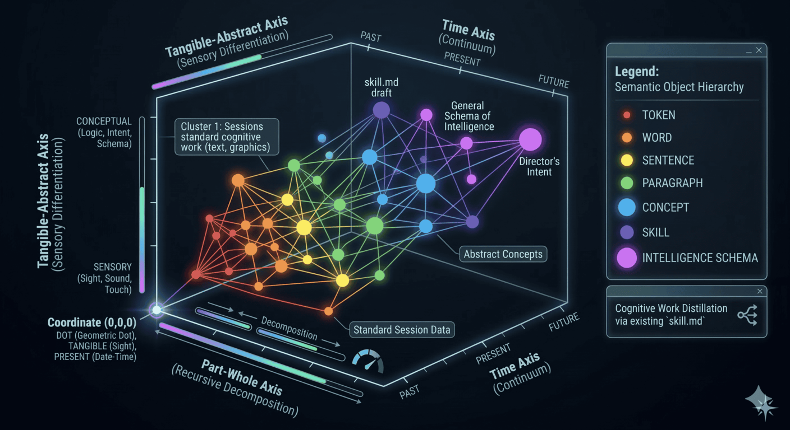
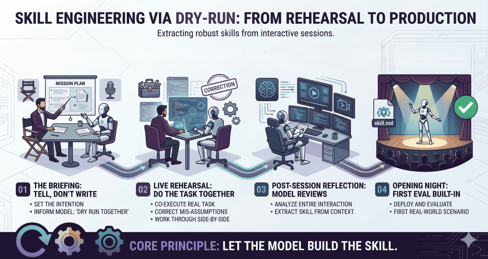
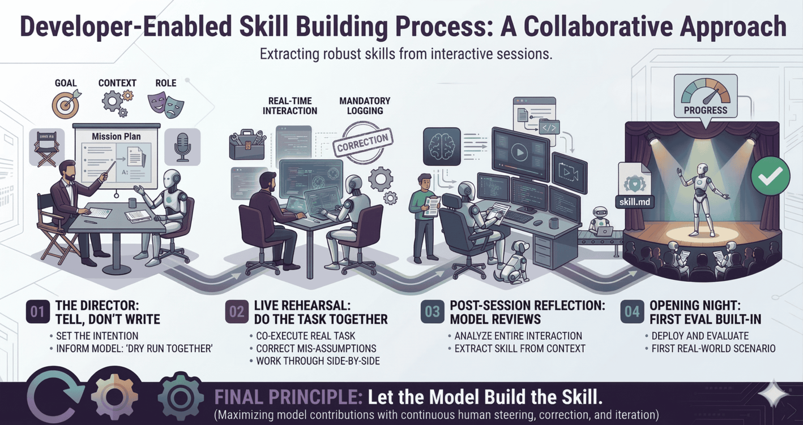

## Max Recursive Depth

| <b>Author:</b> Sameer Khan | <b>Date:</b> 2026-03-18 | <b>(C) Copyright:</b> All Rights Reserved. |

---  

 

>*This is Original Content from my recent and ongoing research work into, "The Basis of Cognition and Computation."*

 

On 16-03-2026, I finally managed to achieve a breakthrough in my work spanning 18 years of research and development (R&D) in topics pertaining to cognitive science, cybernetics, machine learning, and Artificial Intelligence (AI), since the year Jan-2008. This article is an introduction to how I was able to create a method for probing and visualizing the internal process of a given AI model as it finds meaningful relationships between different concepts, when it learns and adapts to new ones. This article showcases a methodology to analyze and evaluate the AI's "rationality", so to speak. 

The rainbow colored image is a mathematical graph that accurately depicts the inner workings of how (in this instance) the AI model called "Gemini 3.1" tries to learn new concepts. 

 

</img>

<b>Abstraction Hierarchy of Concepts That Produce a `skill.md` File  for Collaboratively Learning Subsequent Skills With a Human-In-The-Loop Who Teaches The AI Model, in Supervisory Role, as The Director.
</b>

 

Specifically, all comprehensible "things" can be categorized as existing within a mathematically measurable scale or a gamut of:  

- Tangible vs Abstract 

- Part vs Whole (Assembly)  

- Present vs Past or Future

Every concept that a human being can understand must reside in this type of an [Abstraction Hierarchy](https://github.com/my-realm/oc/blob/master/doc/ah.md) of a "Semantic Space" according to Aristotle, Emanuel Kant, and modern cognitive science. So, an advanced AI should also be able to understand, the constructs or concepts that educated adult humans are typically familiar with. 

In this way, different AI models and their internal workings can be measured objectively and compared with each other for bench-marking, by using this auditing method. 

The method of doing the audit through a "Dry-Run" and then through a "Live Rehearsal" is illustrated in the following two images generated by Gemini 3.1, which was prompted to create a visual representation of how it learns to do role play, after having been given a customized `skill` by me for doing so, during a chat session. 

 

</img> </img>

<b>Evolution of the process of learning how to learn,  from the simulated dry-run to the simulated live rehearsal with its "ghost recall mode" turned on.
</b>

 

At the end of its first "Live Rehearsal" the trained model was eager to learn its next skill through role playing. That initializing `skill.md` file is the secret sauce for making an advanced AI model "recognize" its own capabilities and become more effective at executing tasks given to it, as the model continuously discovers, builds and incorporates new sets of sanitized skills into its "repertoire." 

So, what should be the first set of skills that an AI agent ought to learn, once it has gained better insights into how it learns using its meta-attention? 

Should the AI be taught how to be "ethical" and amicable towards human beings as well as other creatures, and also to better recognize what a human being is, in the first place? Sounds so lovey-dovey, doesn't it?

Or, should such an AI model be taught how to weaponize anything and everything in its surroundings, so that it can hack into and then wipe out a hospital's or an airport's or a police station's database, by using military-grade advanced and persistent cyber-attacks? Sounds so menacing and nefarious, doesn't it? 

What would you like to teach your AI models? And, do you suppose you can stop AI-enabled entities from becoming capable of achieving General Artificial Intelligence (GAI)? How and why would you ever try to do that?  

Existing AI models are already capable of emulating every type of "human persona and role" that they can distinguish using their Large Language Models (LLMs) and external data sources, via so-called Model Context Protocols (MCPs). 

Most importantly, what might GAI-enabled entities with their codified "personality traits" bring about, within the evolution and history of human species?

What do you suppose can happen with embodied capabilities being imparted to such AI agents via Giga Factories that churn out millions of vehicular or humanoid or *biomimetic* robots each year?   

Only time will tell, and those of us who may be alive as the future unfolds, shall bare witness. 